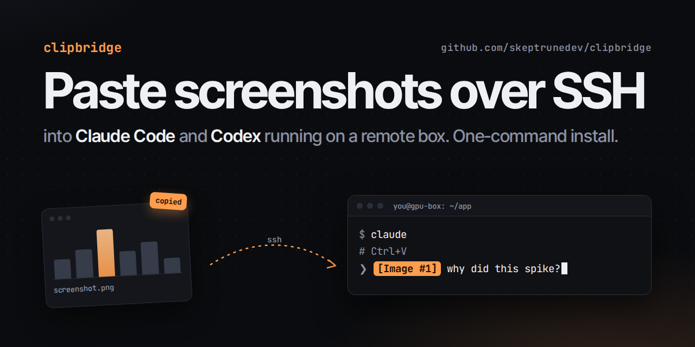

# clipbridge



**Paste screenshots into Claude Code and Codex when they run on a remote machine over SSH.**

You run your coding agents on a beefy box over SSH (often inside tmux, herdr or a
VS Code Remote terminal). You take a screenshot, press Ctrl+V, and... nothing.
A terminal can only paste text, and the agent reads images from the clipboard of
the machine *it* runs on, which is a headless server with no clipboard at all.

clipbridge fixes that. Copy an image on your laptop, press Ctrl+V in the agent,
and the image is there.

- Works with **Claude Code** and **Codex CLI**, with no plugins or config.
- Senders for **macOS** and **Linux desktops (X11)**; the SSH host is any Linux box.
- Works inside tmux, herdr, screen, VS Code Remote-SSH: anything that forwards Ctrl+V.
- **Only images leave your laptop.** Text you copy never crosses the wire.
- Everything rides your existing SSH login. No ports, no daemons listening.

## Install

Run this **on the desktop you copy images on**, naming the SSH host(s) where
you run Claude Code or Codex (any name that works with `ssh`):

```bash
curl -fsSL https://raw.githubusercontent.com/skeptrunedev/clipbridge/main/install.sh | bash -s -- my-server
```

It installs the sender on your desktop, then SSHes into `my-server` to set up
the receiver there. Pass several hosts to bridge to all of them.

Then, **on the server, open a new shell** (or run `exec $SHELL`) and start
`claude` or `codex` from it. Shells that were already open don't have the
display variable the agents need.

### Requirements

| Where | Needs |
| --- | --- |
| Your desktop | macOS with Xcode Command Line Tools (`xcode-select --install`), or Linux with an X11 session |
| SSH host | Linux with systemd and `apt`, `dnf` or `pacman`; sudo once, to install `Xvfb`, `xclip` and `python3-xcffib` |
| Between them | Key-based SSH that works without a prompt: `ssh -o BatchMode=yes my-server true` |

## Usage

1. Copy or screenshot an image on your desktop (macOS: Cmd+Ctrl+Shift+4).
2. In Claude Code or Codex on the server, press **Ctrl+V**. Not Cmd+V: that's
   your terminal's text paste.

That's it. A copied image reaches the server in well under a second.

### VS Code terminal on Linux

If you've bound Ctrl+V to paste in VS Code's terminal, VS Code handles the key
itself and it never reaches the agent. Add a second key that sends a raw Ctrl+V
(Codex already treats Ctrl+Alt+V as image paste):

```jsonc
// keybindings.json
{
  "key": "ctrl+alt+v",
  "command": "workbench.action.terminal.sendSequence",
  "args": { "text": "\u0016" },
  "when": "terminalFocus"
}
```

## Troubleshooting

Run the doctor from your desktop. It checks every hop and says what's wrong:

```bash
curl -fsSL https://raw.githubusercontent.com/skeptrunedev/clipbridge/main/install.sh | bash -s -- --doctor my-server
```

| Symptom | Fix |
| --- | --- |
| Ctrl+V does nothing, doctor is all green | The agent was started from a shell older than the install. Run `exec $SHELL`, then restart the agent. Check with `echo $DISPLAY` (should print `:99`). |
| Ctrl+V pastes nothing in VS Code | See [VS Code terminal on Linux](#vs-code-terminal-on-linux). |
| "no image on the clipboard" | Copying any text on your desktop clears the image on the server, by design. Copy the image again. |
| Sender logs show ssh failures | Make `ssh -o BatchMode=yes my-server true` work (keys, `ssh-agent`, host key accepted). |

Logs: `~/Library/Logs/clipbridge.log` (macOS), `journalctl --user -u clipbridge-send` (Linux desktop).

## How it works

```
 your desktop                                   SSH host
┌──────────────────────────┐                  ┌───────────────────────────────────┐
│ copy image               │  one long-lived  │ clipbridge-recv owns the clipboard │
│   → clipbridge sender ───┼──── ssh stream ──┼─→ of a tiny virtual display (Xvfb) │
│     (LaunchAgent / user  │                  │   :99                             │
│      systemd unit)       │                  │        ▲                          │
└──────────────────────────┘                  │        │ Ctrl+V                   │
                                              │   claude / codex  (DISPLAY=:99)   │
                                              └───────────────────────────────────┘
```

Claude Code and Codex already know how to read images from an X11 clipboard.
clipbridge gives the server one: a 64×64 virtual display whose clipboard mirrors
the images you copy on your desktop.

- **Sender.** On macOS, a small Swift LaunchAgent watches the pasteboard. On
  Linux, a systemd user unit gets XFixes clipboard events, so there's no polling.
  When you copy an image, it sends it as PNG (screenshots, browser images and
  image files copied in Finder all work). When you copy anything else, it tells
  the server to drop the image, so you never paste a stale screenshot.
- **Transport.** One SSH connection per host, kept open and reopened after sleep
  or network changes. Shell startup on the server is paid once, not per copy.
- **Receiver.** `clipbridge-recv` owns the virtual display's clipboard and
  serves the image as a single X property. That matters: Codex's clipboard
  library abandons chunked (INCR) transfers after 10ms, and an abandoned
  transfer wedges xclip-based owners forever.
- **Several desktops.** The last copy wins. A sender only pushes copies made
  while it's running, and clearing never touches another desktop's image.

## Uninstall

```bash
curl -fsSL https://raw.githubusercontent.com/skeptrunedev/clipbridge/main/install.sh | bash -s -- --uninstall my-server
```

This removes the sender from your desktop and the receiver, display service
and shell line from each host. Installed packages are left alone.

## Limitations

- Images only, one way (desktop → server). Text already pastes fine through the terminal.
- Linux desktops need X11. GNOME and KDE Wayland sessions *may* work through
  XWayland, but that's untested. Windows isn't supported yet.
- Images larger than the X server's request limit (64 MB here) are skipped.

## License

MIT
